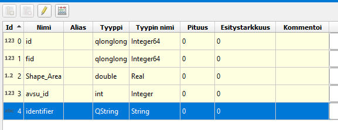
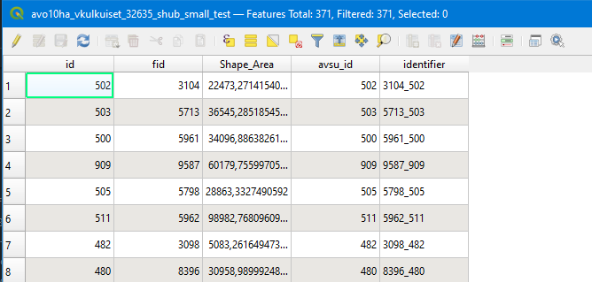
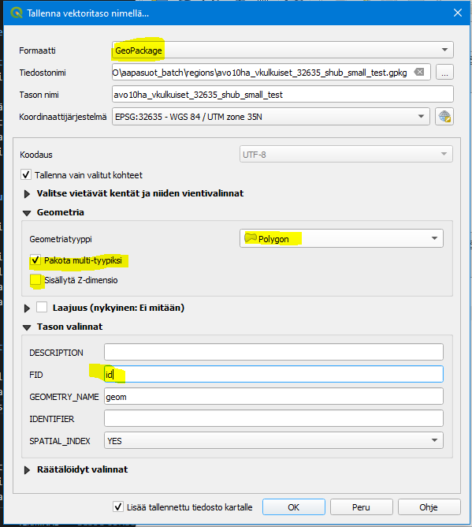
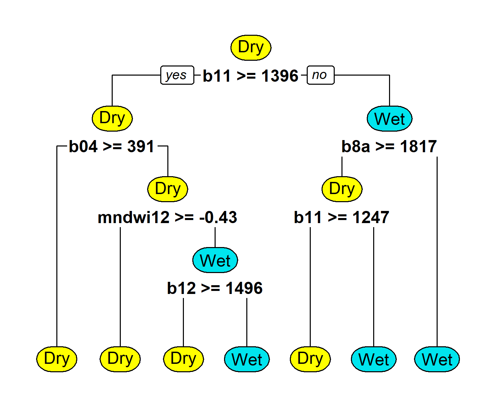
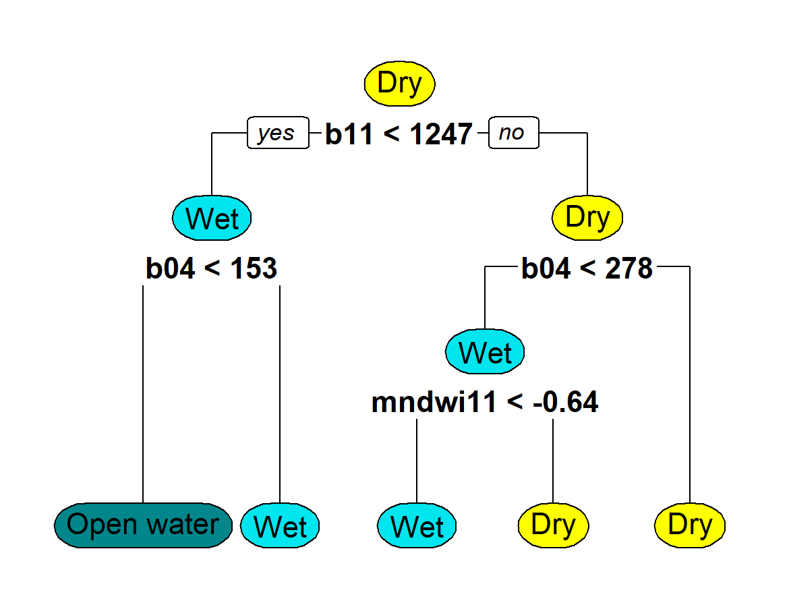

# Aapa mire wetness index retrieval with Sentinelhub Batch statistical API

Data preparation tools for article 

*Jussila et. al. (2023)*: _Quantifying wetness variation in aapa mires with Sentinel-2: towards improved monitoring of an EU priority habitat_ 

Monitoring wetness variation and drought response of boreal aapa mires with Sentinel 2 optical satellite imagery 

Demonstration of retrieving zonal statistics of Sentinel-2 MSI L2 indexes using [Sentinel-hub Batch Statistical API](https://docs.sentinel-hub.com/api/latest/api/batch-statistical/)


# Goals

Retrieve regional statistics as time-series for a set of aapa-mires over northern Finland for years 2017-2020. Results include output from 2 surface type classification algorithms and selected reflectance bands.

As available cloud masking algorithms are not optimal with regards to cloud shadows, we need cloud coverage percentage of extended boundingbox of each AOI to filter out cases where AOI may be affected by cloud shadow artifact.

# Preprocessing of the aapa-mire gis dataset

## Coordinate systems
Sentinelhub does not support Finnish national system  ETRS89 / TM35FIN(E,N)(EPSG:307). For this study we have selected WGS 84 / UTM zone 35N  (EPSG:32635) as the default crs. 

NOTE: Pseudo-Mercator (EPSG:3857) should not be used in the northern latitudes as it distorts the dimensions and rectangular grids grow unneccessarily large.

## Identifier fields of polygon dataset

Batch Statistical API operates based on fields "id" ja "identifier". Result files will be named using field "id" and contents of the "identifier" field are included in the result data structure.

In this study the field "id" corresponds to mire-index (avsu_id) of the original dataset and "identifier" is constructed from linear index of the original dataset, combined with mire index as 

    to_string('fid')+'_'+to_string('avsu_id')




## Polygon data format and exporting 

Sentinelhub supports only geopackage. Batch Statistical API does not support data with z-coordinates and it must not be used when exporting data with  QGIS. After export, usually VACUUM operation reduces the file size significantly



# Splitting the dataset for processing

2 polygon datasets were created, one for <=1km2 polygons and another for the rest. Smaller polygons were processed in 10m and larger in 20m spatial resolution to reduce the processing costs.

## Number of objects

"Swamps classified as difficult, dangerous, and impossible to cross"

* Total number  11917
* Over 10 km2 43
* 1-10 km2 737
* 0.1-1 km2 5352
* Under 0.1 km2 5785

## Temporal coverage

Processing was done yearly from the beginning of April to the end of September, for year 2017-2020

## Processing costs

Sentinelhub measures cost as processing units (PU) that cost ~1,5€/1000PU's

Mires below 1km2 (11000kpl)
* Cloud coverage processing in 100m resoluution ~6000 PU/year, 
* Classification and statistics time series in 10m resoluutio ~60000 PU/year
* Over 1km2 mires in 20m resolution ~30000 PU / year (10m resolution would be 4x)

Total cost of processing of 4 year time series is roughly 600€. 

# Time-series extraction process

# Technical details

Processing needs to be done for each year and for each polygon dataset.

Template for creating and runnign the processing request is given in notebook [statistics_batch.ipynb](statistics_batch.ipynb)


## Authentication

Auhentication keys are defined by renaming the file  [config.json.template](config.json.template) as ./config.json filling in the relevate secrets. Both Sentinel-hub and AWS keys are mandatory as results are stored on AWS S3 bucket

## Classifiers and statistics (sentinel-hub payload)

Models for detecting water-saturated mire surfaces were trained with supervised classification in R using ‘rpart’ (Recursive Partitioning and Regression Trees) package. Aerial images derived from Finnish National Land Survey (NLS) were used to compose a set of training data points including various wet and drier mire surfaces. Sixteen conservation areas from different parts of aapa mire occurrence zone were selected to represent regional variation, and in each site 53 to 138 training points were manually classified. Points were selected to represent a range of surfaces from open water and sparsely vegetated wet flarks to drier lawn- and hummock-level surfaces and mire margins with sparse tree-cover. Some of the points represented wet surface dominated mixed pixels, to improve water detection in mires with dense surface structure and small-sized water pools. Additional dry pixels from nearby peat extraction sites were included to represent very dry, unvegetated peat surfaces, which were absent or uncertain in aerial images of N2K sites. Final training dataset consisted of 1460 points representing June or July situation in various years (Classified training points and imagery dates in Zenodo: link). 

Sentinel-2 satellite images used to train the model were selected to maximally correspond with the collection dates of aerial imagery and were aligned with them with Q-gis Georeferencer. Reflectance values of Sentinel-2 bands and a set of common vegetation (NDVI) and moisture indices (mNDWI-b11,mNDWI-b12, NDWI-McFeeters, NDMI) were extracted and calculated for training points. Two decision tree models were trained, one (CL2) classifying surfaces to wet and drier surfaces, and the other (Cl3) having an additional third class for open water surfaces. CL2 was trained with full set of points (1460), whereas in training of CL3 mixed pixels were excluded. Selected models had following rpart -calls:  
````
CL2 <- rpart(class2obs~., data= train, method = 'class', control = rpart.control(xval = 5), parms = list(prior=c(1/2, 1/2))) 
````
````
CL3 <- rpart(formula = class3obs ~ ., data = train, method = "class", control = rpart.control(xval = 5)) 
````
Overall accuracies were 93.6 and 95.5%, and Kappa values 83.8 and 90.1 for the two models. Seasonally (visual inspection) CL3 showed profound changes in mire surfaces, whereas CL2 indicated more moderate changes. Both models, particularly CL3, had a tendency of misclassifying tree-covered pixels as wet mire surfaces.  

The two classification algorithms were recoded as SentinelHub evalscripts, defined in sumi-statistics-evalscript.js. CL2-model -based metrics were used in Jussila et al. (2023) article, “Quantifying wetness variation in aapa mires with Sentinel-2: towards improved monitoring of an EU priority habitat”.  

Classifier decision trees are demonstrated in following graphs: 

Classification algorithms are defined in [sumi-statistics-evalscript.js](./js/sumi-statistics-evalscript.js)

Class names are demonstrated in following graphs:

### Two-phase classification = CL2 



### Three-phase classification = CL3 


## Additional cloud coverage processor

Avaible cloud masking algorithm do not detect cloud shadows reliably. Therefore we compute also cloud coverage percentage for a extended boundingbox around each polygon. Cloud percentage of this boundingbox is then used to filter out cases where potential shadows may affect the otherwise cloud-free polygon region.
Extended boundingbox includes 0.5km buffers to east-west-north and 4km to south.

These boundingboxes are processed in 100m resolution (rough cloudiness estimate is enough)

* [sumi-cloudmask-evalscript.js](./js/sumi-cloudmask-evalscript.js)

## Postprocessing of Batch Statistical API resuls 

API does not directly provide methods for retrieving the pixel counts of individual classes. Pixels counts can be retrieved by requesting histogram of the results and de-codig values in a postprocessing step. 

Region-wise conversion of the raw (json) results to pandas-compatible CSV-format is demonstrated in notebook

* [postprocessing.ipynb](postprocessing.ipynb)

## Input and result datasets

Polygons (in geopackage format) must stored in a AWS S3 bucket in eu-central-1 region that Sentinel-hub can read. Results are also written to given AWS S3 bucket.

For more details, see Sentinelhub documentation https://docs.sentinel-hub.com/api/latest/api/batch-statistical/#aws-bucket-access

Processed data can be retieved for local processing with e.g. aws-cli

````
aws --profile myprofile s3 sync s3://<mybcuket> .
````


# [TBD] Outlier detection and filtering 


